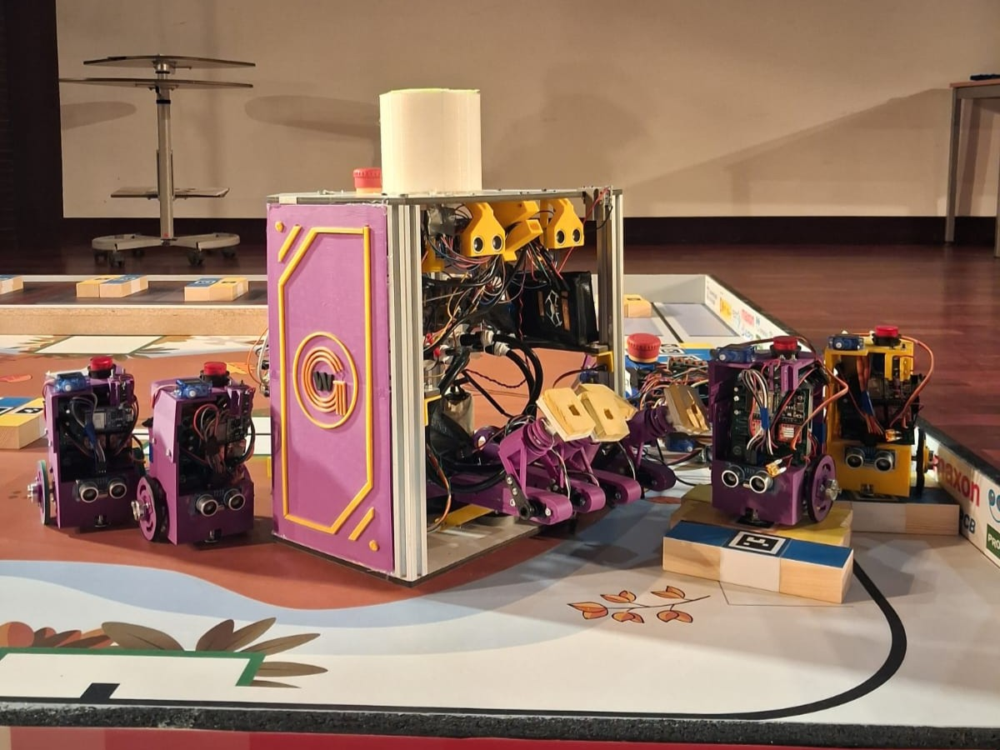

# 🤖 Eurobot Autonomous Mobile Robot - Golden Wires

Official software and technical documentation repository for the **Golden Wires** robotics team for the international **Eurobot** competition (3x International Finals qualifiers in France).

---

## 🛠️ Tech Stack & Technologies

* **Programming Languages:** Python, C++
* **Microcontrollers & Hardware:** ESP32, Raspberry Pi 4, Step Motor Drivers, Circuit Assembly & Soldering
* **Computer Vision & Navigation:** OpenCV, ArUco Markers Detection, Image Processing
* **Design & Prototyping:** Solid Edge, SketchUp, 3D Printing

## ⚙️ Repository Structure
* `vision/` -> ArUco marker detection & image processing scripts (Python/OpenCV)
* `movement/` -> Microcontroller logic, motor control & sensor integration (C/C++)
* `communications/` -> MAC Addresses & raspberry-espCam communication
* `repository-media-files/` -> Photos of the proyect
* `README.md`
